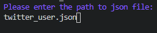
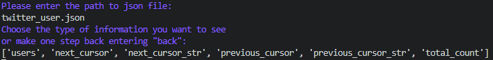
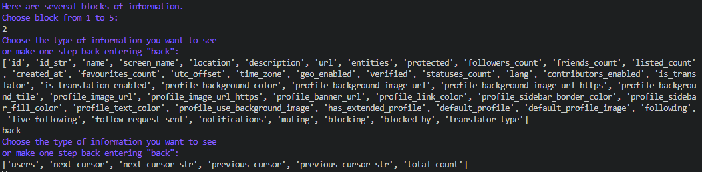
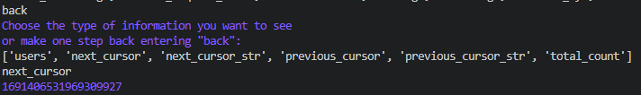

# Task2_Navigate_Json

## Installation and usage

Download repository and import module "navigate_json.py"

```python
import navigate_json

navigate_json.main()
```
Then program will ask you to enter the path to your json file(the file used in example is given in repository):




Then you will get all types of information that includes file:




You can move deep in file or return back step by step:




If chosen type of information has no more types in, you will get the information:




## Contributing
Pull requests are welcome. For major changes, please open an issue first to discuss what you would like to change.

## LICENSE
[GNU](https://github.com/hooloobooroodkoo/Film_map/blob/main/LICENSE)
